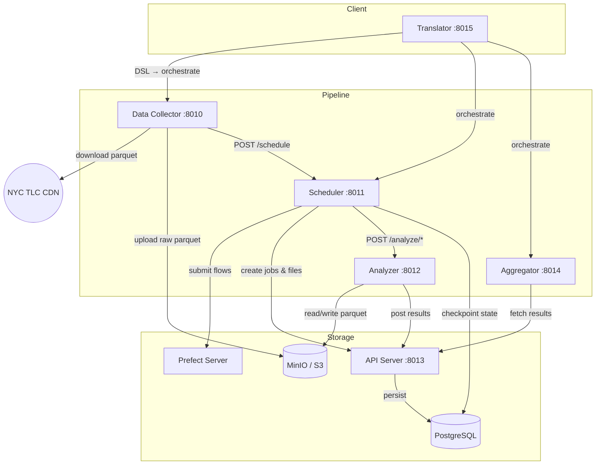

# Checkpointing in Distributed Systems — ETL Pipeline

A thesis project investigating how checkpointing affects fault tolerance, recovery time, and resource efficiency in distributed architectures. The research vehicle is a microservice-based ETL system that processes NYC TLC (Taxi & Limousine Commission) taxi trip data through five sequential analytical steps, persisting state after each step so that on failure any service can resume from the last checkpoint.

## Architecture



## Services

| Service | Port | Role |
|---------|------|------|
| Data Collector | 8010 | Downloads TLC parquet files, validates schema, uploads to MinIO |
| Scheduler | 8011 | Orchestrates the 5-step analytical pipeline via Prefect, manages checkpoints |
| Analyzer | 8012 | Runs analytical steps (descriptive stats → cleaning → temporal → geospatial → fare/revenue) |
| API Server | 8013 | CRUD for files, jobs, results; exposes pipeline metrics |
| Aggregator | 8014 | Computes cross-file aggregate statistics |
| Translator | 8015 | JSON DSL interface that orchestrates the full pipeline end-to-end |

## Tech Stack

Python 3.12 · FastAPI · Polars · Prefect 3 · PostgreSQL · MinIO · Docker Compose · uv

## Quick Start

```bash
docker compose -f src/infrastructure/compose/docker-compose.yml up --build
```

## Testing

Each service has its own test suite under `src/<service>/tests/`, run with:

```bash
cd src/<service>
uv run pytest
```
